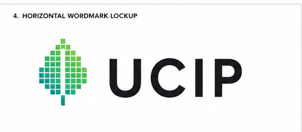

<div align="center">



**A research-backed decision-support platform for Mumbai's ward-level heat vulnerability.**

[](LICENSE)


</div>

---

UCIP tells a city planner **which Mumbai wards to cool first, why, what intervention to use, and
where to spend a fixed budget**, grounded in published climate and ecology literature, not
arbitrary weights.

> **Status: prototype live.** The full data pipeline, HVI computation, NBS engine, and a working
> Leaflet frontend (choropleth, plantability layer, green-cover-change layer, ward cards,
> methodology page) are built and running end-to-end on real Mumbai data. See
> [docs/UCIP-Pitch-Deck.pdf](docs/UCIP-Pitch-Deck.pdf) for the full write-up.


## What it does

1. **Heat Vulnerability Index (HVI)** - grid-level (1 km) choropleth over Mumbai, rolled up to the
   24 BMC wards. Weights are literature-derived (PCA per Reid et al. 2009), never arbitrary.
2. **Explainability** - a factor-contribution breakdown of a transparent linear index per ward. No
   SHAP, by design (nothing black-box to explain).
3. **Nature-Based Solutions engine** - rule-based recommendations (native trees, cool roofs, pocket
   parks, cooling centres, rain gardens) with an **ecological plantability filter**: trees only
   where restoration literature supports them (Bastin 2019), non-tree cooling elsewhere (Veldman
   2019, Friedlingstein 2019).
4. **Green-cover change** - per-cell NDVI delta classified gained/stable/lost across two dry-season
   composites.
5. **Methodology page** - every variable, weight, dataset, assumption, and limitation, with
   citations, computed live from the pipeline's own output.

Demonstrated on Mumbai; the architecture is city-agnostic.

## Structure

```
frontend/   Next.js 16 + TypeScript + Tailwind + Leaflet (map, ward cards, methodology page)
pipeline/   Python 3 + Google Earth Engine (grid, HVI, NBS rules, sensitivity check)
supabase/   Postgres + PostGIS schema and migrations
data/       Ward boundaries + committed GeoJSON snapshots (demo-safe fallback)
docs/       Methodology, citations, pitch deck, brand assets
```

## License

MIT, see [LICENSE](LICENSE).
