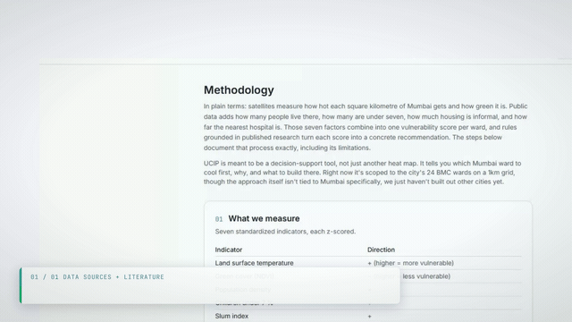

<div align="center">


**A research-backed decision-support platform for Mumbai's ward-level heat vulnerability.**

[](https://doi.org/10.5281/zenodo.22923919)
[](LICENSE)


**[Open the live dashboard](https://uciplatform.vercel.app/dashboard)**

</div>

---

**The problem:** City planners have no ranked, justified, ward-level tool to decide where to build
cooling interventions in Mumbai. Existing tools either ignore spatial heat variation or use arbitrary
weights that can't justify the ranking to residents and decision-makers.

**UCIP solves this** by ranking all 24 BMC wards by heat vulnerability, computed transparently from
published climate and ecology literature. Every weight, dataset, and assumption is documented with DOI links.

> **Status: prototype live.** The full data pipeline, HVI computation, NBS engine, and a working
> Leaflet frontend (choropleth, plantability layer, green-cover-change layer, ward cards,
> methodology page) are built and running end-to-end on real Mumbai data.

<div align="center">

</div>

## What it does

1. **Heat Vulnerability Index (HVI)**: grid-level (1 km) choropleth across Mumbai, rolled up to 24 BMC wards. PCA-derived weights from Reid et al. 2009, not arbitrary.
2. **Explainability**: factor-contribution breakdown of a transparent linear index per ward. No black-box SHAP.
3. **Nature-Based Solutions engine**: rule-based recommendations (native trees, cool roofs, pocket parks, cooling centres, rain gardens) with an ecological plantability filter. Trees only where restoration literature supports them (Bastin 2019), non-tree cooling elsewhere.
4. **Green-cover change**: per-cell NDVI delta classified as gained/stable/lost across two dry-season composites.
5. **Methodology page**: every variable, weight, dataset, assumption, and limitation with citations, computed live from pipeline output.

<div align="center">

</div>

<div align="center">

</div>

**City-agnostic:** This architecture runs on any city. See [docs/adding-a-city.md](docs/adding-a-city.md) to replicate.

## Quick Start

```bash
git clone https://github.com/AnayDhawan/ucip.git
cd ucip/frontend
npm install
npm run dev
```

Opens at `localhost:3000`. The dashboard runs entirely off committed GeoJSON snapshots in `data/`, so no Supabase or Google Earth Engine credentials are needed to browse it. See [CONTRIBUTING.md](CONTRIBUTING.md) for full pipeline setup (only needed if touching the data layer).

## Structure

```
frontend/   Next.js 16 + TypeScript + Tailwind + Leaflet (map, ward cards, methodology page)
pipeline/   Python 3 + Google Earth Engine (grid, HVI, NBS rules, sensitivity check)
supabase/   Postgres + PostGIS schema and migrations
data/       Ward boundaries + committed GeoJSON snapshots (demo-safe fallback)
docs/       Methodology, citations, screenshots
```

## API

A read-only public API serves the same data, no key required, open CORS:

```bash
curl 'https://uciplatform.vercel.app/api/v1/lookup?lat=19.076&lon=72.877'
```

```bash
curl 'https://uciplatform.vercel.app/api/v1/wards'
```

```bash
curl 'https://uciplatform.vercel.app/api/v1/wards/L'
```

```bash
curl 'https://uciplatform.vercel.app/api/v1/recommendations/L'
```

Full reference: [docs/api.md](docs/api.md). Live spec: [`/api/v1/openapi.json`](https://uciplatform.vercel.app/api/v1/openapi.json).

## Documentation

- [docs/methodology.md](docs/methodology.md) - HVI indicators, PCA weights, NBS rules, plantability filter.
- [docs/references.md](docs/references.md) - Citation table for every variable and weight with DOIs.
- [docs/HVI-methodology-report.md](docs/HVI-methodology-report.md) - Full technical report with pipeline output, PCA weights, sensitivity analysis, and plantability-filter numbers.
- [docs/DATA-DICTIONARY.md](docs/DATA-DICTIONARY.md) - Every dataset column: unit, range, source, derivation, limitations.
- [pipeline/README.md](pipeline/README.md) - Running the pipeline as one orchestrated refresh, cadence options, and change-diff tool.

## Contributing

See [CONTRIBUTING.md](CONTRIBUTING.md). Please read the [Code of Conduct](CODE_OF_CONDUCT.md) first.

## Contact

Bugs, data questions, or a ward that wants this used for real, open an issue.

## Citation

```bibtex
@software{ucip_2026,
  author = {Dhawan, Anay},
  title = {UCIP: Urban Climate Intelligence Platform},
  year = {2026},
  doi = {10.5281/zenodo.22923919},
  url = {https://github.com/AnayDhawan/ucip}
}
```

## License

Apache 2.0, see [LICENSE](LICENSE).
